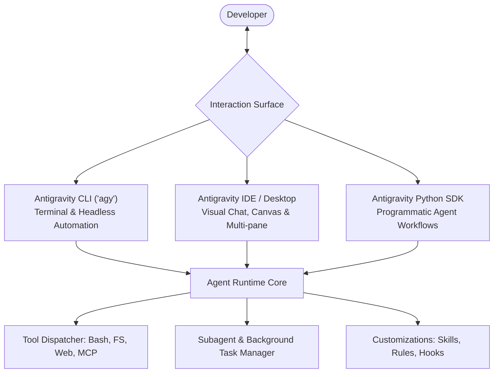
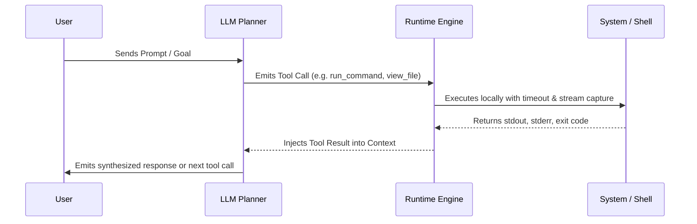

# Deep Dive: Google Antigravity Guide (`antigravity-guide`)

Google Antigravity (AGY) is an agentic pair-programming and development environment designed by Google DeepMind. It pairs autonomous tool execution with human-in-the-loop workflows across multiple interfaces (CLI, Desktop IDE, and Python SDK).

---

## 1. System Surfaces & Architecture

Antigravity operates across three primary surfaces:

### A. The CLI (`agy`)
* **Interactive Terminal:** REPL interface supporting prompt autocomplete, streaming syntax highlighting, and slash commands.
* **Headless Execution:** Designed for CI/CD and non-interactive scripting (`agy -p "prompt" --headless`).
* **Subprocess & Persistent Terminals:** Supports both one-shot command execution and persistent shell terminals that preserve environment variables across calls.

### B. The Desktop Application / IDE
* **Auxiliary Task Pane:** Real-time visibility into running background tasks, subagent lifecycles, and terminal output.
* **Artifacts Engine:** Interactive rendering of Markdown reports, diffs, Mermaid diagrams, and browser previews in dedicated artifact tabs.

### C. Python SDK
* Programmatic interface for leasing agents, dispatching structured prompts, and exposing custom Python functions as first-class agent tools.

---

## 2. Agentic Tool Calling & Execution Lifecycle

When an agent needs to interact with the environment, it uses a structured tool execution loop:

### Key Tooling Categories:
1. **File System Operations:** `view_file`, `write_to_file`, `replace_file_content` (single contiguous chunk modifications with line-range validation).
2. **Execution & Process Management:** `run_command` (synchronous execution or background dispatch), `manage_task` (status, kill, send_input).
3. **Reactive Wakeup:** Asynchronous tasks and subagents wake the model automatically upon completion without polling loops.
4. **Model Context Protocol (MCP):** Connects external tool servers (FastMCP, stdio, SSE) to the agent tool dispatcher.

---

## 3. Core Slash Commands Reference

| Slash Command | Primary Purpose | Best Used When |
|---|---|---|
| `/goal` | Autonomous execution | Running long-running tasks where the agent works until verification passes. |
| `/plan` | Pre-implementation design | Deconstructing complex engineering tasks into verifiable milestones. |
| `/grill-me` | Alignment interview | Interactively vetting architecture and resolving ambiguous design choices. |
| `/schedule` | Automation timing | Scheduling one-time timers or recurring cron triggers. |
| `/browser` | Web automation | Executing browser-driven testing, DOM inspection, and navigation. |
| `/learn` | Guideline persistence | Persisting corrections and specialized workflows into `.agents/rules`. |
| `/boost` | Multi-perspective reasoning | Deep analysis requiring multiple concurrent perspectives and rigorous review. |
