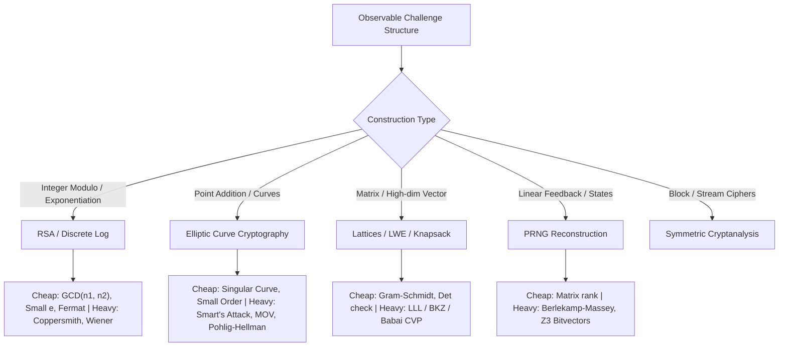

# Deep Dive: `ctf-crypto` Skill

The `ctf-crypto` skill guides cryptanalysis in competitive CTFs, covering ciphers, RSA, Elliptic Curves (ECC), PRNGs, lattices, LWE, hash collisions, zero-knowledge proofs (ZKP), and non-standard algebraic structures.

---

## 1. Core Principles

1. **Model Before Attacking:** Avoid blind trial-and-error. Formulate the mathematical equations governing the cryptosystem before writing solver code.
2. **Cheap Discriminating Checks First:** Always run low-cost tests (e.g. GCD checks on moduli, small factor sieves, linear independence tests) before executing heavy reductions like LLL/BKZ or Groebner bases.
3. **Strict Separation of Crypto vs. Math:** Cryptographic context stays in the challenge directory; pure algebraic problem descriptions are handed off to specialized mathematical solvers.

---

## 2. Attack Classification Router

The skill uses [`references/attack-router.md`](file:///home/wsl/tools/auto_download_ctf_challenge/skills/ctf-crypto/references/attack-router.md) to classify challenges based on observable data:



### Key Discrimination Strategies:
* **RSA:**
  * Common modulus $n$ with different $e_1, e_2$ $\to$ Bézout common modulus attack ($a\cdot e_1 + b\cdot e_2 = 1$).
  * High-bit or low-bit known $p$ $\to$ Coppersmith univariate polynomial root finding.
  * $e = 3$ or small with unpadded plaintext $\to$ Direct integer cube root.
* **Elliptic Curves:**
  * Discriminant $\Delta = 0$ $\to$ Singular curve isomorphism to additive or multiplicative group.
  * Order $\#E(\mathbb{F}_p) = p$ (anomalous) $\to$ Smart's $p$-adic attack.
  * Embedding degree $k$ is small $\to$ MOV attack using Weil/Tate pairings to transfer DLP to $\mathbb{F}_{p^k}$.
* **Lattices & LWE:**
  * Knapsack / Subset Sum $\to$ Coster-Joux-Stern or Closest Vector Problem (CVP) reduction.
  * Hidden Linear Forms with Noise $\to$ Learning With Errors (LWE) via Babai Nearest Plane or Dual Lattice attacks.

---

## 3. Mathematical Handoff Schema

When local Python scripts encounter computationally hard reductions, the skill specifies a strict handoff structure defined in [`references/mathematical-handoff.md`](file:///home/wsl/tools/auto_download_ctf_challenge/skills/ctf-crypto/references/mathematical-handoff.md):

* `math_workspace/TASK.md`: Explicit notation describing the ring, field, or lattice, stating variables and boundaries without mentioning the underlying cryptosystem.
* `math_workspace/instance.json`: Precise multi-precision integer strings or matrix arrays:
  ```json
  {
    "modulus": "1234567890123456789...",
    "degree": 4,
    "coefficients": ["0x1a...", "0x2b..."],
    "bound": "0xffffff"
  }
  ```
* `math_workspace/verify.py`: Independent check that evaluates candidate roots against the input matrix or equation.

---

## 4. Operational Scripts

* [`run_astra_expert.py`](file:///home/wsl/tools/auto_download_ctf_challenge/skills/ctf-crypto/scripts/run_astra_expert.py): Calls high-reasoning expert models with temperature calibration tuned for algebraic deduction.
* [`validate_handoff.py`](file:///home/wsl/tools/auto_download_ctf_challenge/skills/ctf-crypto/scripts/validate_handoff.py): Pre-flight sanitation verification ensuring no plaintext leakage or challenge flags are present in the math workspace.
