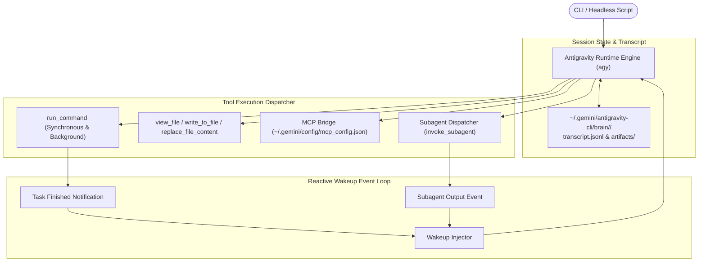

# Deep Dive: Google Antigravity CLI (`agy`)

The `agy` CLI ([`/home/wsl/.local/bin/agy`](file:///home/wsl/.local/bin/agy)) is the command-line runtime for Google Antigravity. It powers both interactive terminal development and autonomous, headless agent execution.

---

## 1. Runtime Architecture



---

## 2. Key Operational Modes

### A. Interactive REPL Mode
Invoked simply as `agy`:
* Provides a full-screen terminal interface with real-time streaming markdown, syntax highlighting, slash command autocomplete (`/goal`, `/plan`, `/schedule`), and interactive tool execution permissions.

### B. Headless Automation Mode
Designed for non-interactive scripts, CI/CD runners, and solver daemons (e.g. `ctf-toolkit`'s `SuperBQA`):
```bash
agy -p "Triage ./chall and output findings as json" --headless
```
* **Streaming Protocol:** Emits structured JSON events over standard output:
  * `step_start`: Signals beginning of planner reasoning turn.
  * `tool_call`: Emits tool name and arguments before execution.
  * `tool_result`: Returns local execution output.
  * `message`: Final text response synthesized by the model.

---

## 3. Tool Dispatch & Concurrency Mechanics

### A. Background Tasks & Reactive Wakeup
In traditional CLI tools, an agent must poll in a loop (`while ps aux | grep ... sleep 2`) to monitor long-running processes. 
In `agy`:
1. `run_command` accepts a `WaitMsBeforeAsync` parameter (e.g. 5000ms).
2. If execution completes within 5 seconds, output is returned synchronously.
3. If the process remains running after 5 seconds, it is automatically detached into a managed background task (`task-<id>`).
4. **Reactive Wakeup:** The agent terminates its turn immediately. When the background process finishes, the runtime engine wakes the model automatically and injects the output into the context. No polling is required.

### B. Persistent Terminals (`RunPersistent`)
`agy` supports stateful persistent shells:
* Passing `RunPersistent=true` returns a `TerminalID`.
* Subsequent `run_command` calls specifying that `RequestedTerminalID` inherit environment variables, virtual environment activations, and shell state across separate tool invocations.

### C. File Modification Safety: `replace_file_content`
Unlike naive file overwrite tools, `agy` uses strict, atomic contiguous block replacements:
* Requires exact line number bounds (`StartLine`, `EndLine`).
* Requires exact character-for-character `TargetContent` matching.
* Verifies file integrity before applying edits, preventing accidental truncation of large source files.

---

## 4. Subagent Delegation & Isolation

The CLI runtime allows a parent agent to invoke isolated child agents via `invoke_subagent`:

| Subagent Type | Workspace Mode | Capabilities | Best Used For |
|---|---|---|---|
| **`self`** | `inherit` | Inherits parent tools, system prompt, and workspace | Offloading complex multi-step tasks in parallel |
| **`research`** | `inherit` | Read-only tools (view files, web search) | Broad exploratory code sweeps without context pollution |
| **Custom** | `branch` or `share` | Configured dynamically via `define_subagent` | Specialized tasks operating in isolated Git branches |

---

## 5. Storage Layout & Data Persistence

* **Global App Data:** [`/home/wsl/.gemini/antigravity-cli/`](file:///home/wsl/.gemini/antigravity-cli/)
* **Session Brains & Transcripts:** `~/.gemini/antigravity-cli/brain/<conversation-id>/`
  * `transcript.jsonl`: Compact event log of all turns, tool calls, and model reasoning steps.
  * `artifacts/`: Generated Markdown artifacts, reports, diagrams, and code deliverables.
  * `scratch/`: Persistent directory for temporary scripts, one-off payloads, and debug logs.
* **Global Customizations:** [`~/.gemini/config/`](file:///home/wsl/.gemini/config/) (contains active `skills/`, `skills.json`, and `mcp_config.json`).
