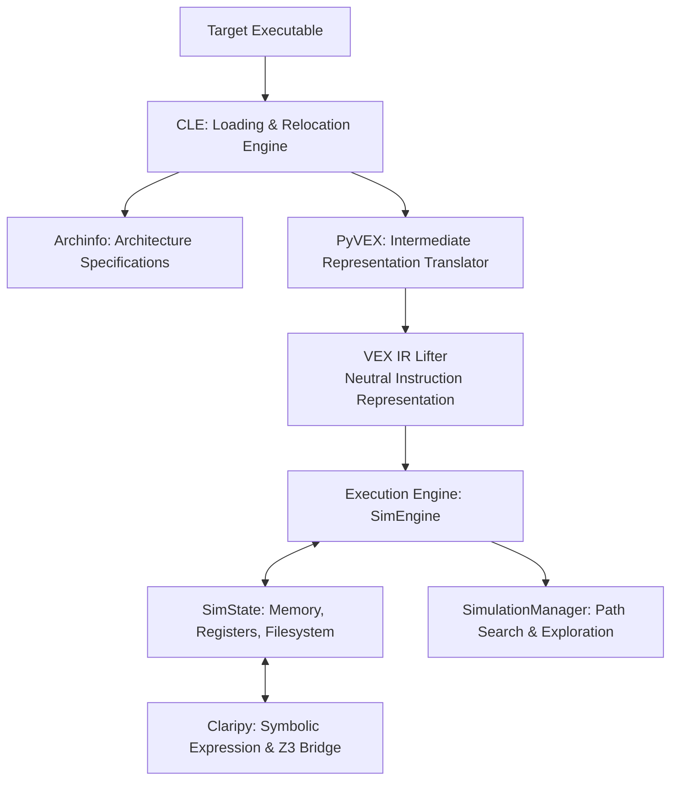

# Deep Dive: Angr Binary Analysis & Symbolic Execution Engine

**Angr** ([`/home/wsl/tools/ctf-venv/bin/angr`](file:///home/wsl/tools/ctf-venv/bin/angr), symlinked to [`/home/wsl/.local/bin/angr`](file:///home/wsl/.local/bin/angr)) is a multi-architecture binary analysis platform developed by the Computer Security Lab at UC Santa Barbara. It combines static analysis, Control Flow Graph (CFG) generation, and dynamic symbolic execution.

---

## 1. Internal Architecture & Core Components

Angr is composed of several independent libraries that form an analysis pipeline:



### Core Libraries Breakdown:
* **CLE (CLE Loads Everything):** Binary loader that parses ELF, PE, and Mach-O headers, maps memory sections, resolves relocations, and simulates dynamic linkers.
* **PyVEX:** Lifts multi-architecture machine code (x86, x64, ARM, AArch64, MIPS, PPC) into **VEX Intermediate Representation (IR)**. Analysis algorithms operate on VEX IR rather than architecture-specific opcodes.
* **Claripy:** Symbolic expression abstraction layer. Translates Pythonic symbolic operations into constraint systems solved by Microsoft Z3.
* **SimuVEX / SimEngine:** Simulates execution steps by evaluating VEX IR statements against a `SimState`.
* **SimProcedures:** High-level Python replacements for standard library functions (e.g. `strcmp`, `malloc`, `printf`). Executing raw glibc assembly blows up symbolic path counts; SimProcedures replace library internals with concise algebraic summaries.

---

## 2. Dynamic Symbolic Execution (DSE)

In standard execution, CPU registers and memory hold concrete values (e.g. `rax = 0x41`).
In symbolic execution:
1. Input bytes are treated as **mathematical symbols** ($\alpha_0, \alpha_1, \dots$).
2. Every instruction transforms symbols into symbolic expressions (e.g. $\text{rax} = \alpha_0 \oplus 0\text{x5a}$).
3. When execution reaches a conditional branch (`if (rax == 0)`):
   * Angr splits the state into **two parallel states**:
     * **Branch True:** State receives the constraint $\alpha_0 \oplus 0\text{x5a} == 0$.
     * **Branch False:** State receives the constraint $\alpha_0 \oplus 0\text{x5a} \ne 0$.
4. **Path Exploration:** The `SimulationManager` advances states along exploration paths until target addresses (`find`) are reached or forbidden addresses (`avoid`) are pruned.
5. **Concrete Input Generation:** Claripy queries Z3 to solve the accumulated path constraints, outputting the exact stdin bytes required to traverse that path.

---

## 3. Standard Analysis Template

```python
import angr
import claripy

# 1. Load project (disable auto_load_libs to skip third-party library bloat)
proj = angr.Project('./chall', auto_load_libs=False)

# 2. Define symbolic input
FLAG_LEN = 32
flag_chars = [claripy.BVS(f"flag_{i}", 8) for i in range(FLAG_LEN)]
flag = claripy.Concat(*flag_chars + [claripy.BVV(b'\n')]) # append newline

# 3. Create initial entry state with symbolic standard input
state = proj.factory.entry_state(stdin=flag)

# 4. Constrain symbolic characters to printable ASCII
for b in flag_chars:
    state.solver.add(b >= 0x20, b <= 0x7e)

# 5. Initialize SimulationManager
simgr = proj.factory.simulation_manager(state)

# 6. Define target and avoid addresses
TARGET_ADDR = 0x401250 # Address printing "Correct!"
AVOID_ADDR  = 0x401270 # Address printing "Wrong!"

# 7. Explore execution tree
simgr.explore(find=TARGET_ADDR, avoid=AVOID_ADDR)

# 8. Extract solution from winning state
if simgr.found:
    winning_state = simgr.found[0]
    solution = winning_state.solver.eval(flag, cast_to=bytes)
    print(f"[+] Found Solution: {solution.strip().decode(errors='ignore')}")
else:
    print("[-] No path found reaching target address")
```

---

## 4. The Path Explosion Challenge & Mitigations

The primary limitation of symbolic execution is **Path Explosion**: loops and nested conditionals cause the number of states to grow exponentially ($2^N$).

### Mitigation Techniques:
1. **Hooking Complex Functions:** Replace time-consuming hash or encryption loops with custom `SimProcedure` hooks that constrain output directly.
2. **`blank_state(addr=...)`:** Bypass setup code, main menus, and input parsing by jumping directly to the validation function with pre-configured register arguments.
3. **Exploration Techniques:** Use directed search techniques instead of naive breadth-first search (`simgr.use_technique(angr.exploration_techniques.DFS())`).
