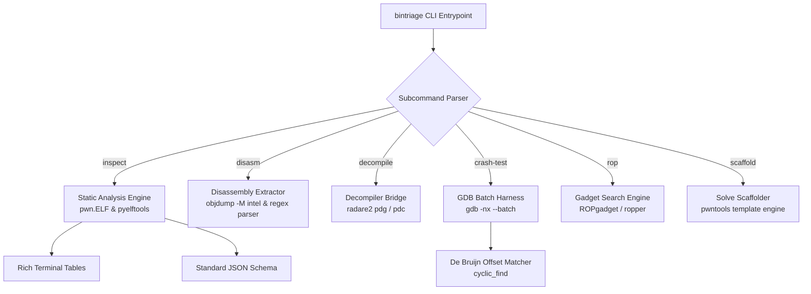

# Deep Dive: `bintriage` CLI Tool

`bintriage` is a standalone binary triage, disassembly extraction, crash diagnostic, and exploit scaffolding utility located at [`/home/wsl/.local/bin/bintriage`](file:///home/wsl/.local/bin/bintriage) (aliased as `bin-triage`). It is designed for headless, terminal-first binary analysis.

---

## 1. Architectural Overview



---

## 2. Internal Implementation & Modules

### A. Static ELF Analysis Engine
The static inspection routine (`analyze_elf`) extracts file properties without executing the untrusted binary:
1. **Cryptographic Hashes:** Calculates MD5 and SHA-256 checksums alongside file size.
2. **Binary Hardening Checks:** Queries the ELF program headers and dynamic section:
   * **RELRO:** Evaluates `PT_GNU_RELRO` and the `BIND_NOW` dynamic tag to distinguish `No RELRO`, `Partial RELRO`, and `Full RELRO`.
   * **Stack Canary:** Searches the symbol table for `__stack_chk_fail` or `__stack_chk_guard`.
   * **NX (No-Execute / DEP):** Checks `p_flags` on the `PT_GNU_STACK` header (executable `PF_X` vs non-executable).
   * **PIE (Position Independent Executable):** Inspects the ELF object type (`ET_EXEC` vs `ET_DYN`).
3. **Symbol Table & Boilerplate Filtering:**
   Raw binaries contain dozens of compiler runtime initialization functions. `bintriage` filters out known CRT boilerplate:
   ```python
   BOILERPLATE_SYMBOLS = {
       '_init', '_fini', '_start', '__libc_csu_init', '__libc_csu_fini',
       'deregister_tm_clones', 'register_tm_clones', '__do_global_dtors_aux',
       'frame_dummy', '__libc_start_main', '__gmon_start__', '__cxa_finalize'
   }
   ```
   Remaining functions are scanned for target keywords (`win`, `vuln`, `flag`, `admin`, `secret`, `shell`, `exec`) and highlighted separately.
4. **Sensitive Import Detection:**
   Monitors the Global Offset Table (GOT) and Procedure Linkage Table (PLT) for sensitive API calls (`system`, `read`, `gets`, `mprotect`, `mmap`, `ptrace`, `prctl`, `seccomp`).

---

### B. Headless Dynamic GDB Batch Harness
Interactive GDB sessions hang in automated or agentic environments. `bintriage crash-test` executes binaries non-interactively using GDB batch mode:

1. **Isolation Flags:** Runs `gdb -nx --batch` to prevent user `.gdbinit` extensions (like Pwndbg) from pausing or waiting for terminal interaction.
2. **Auto-Configuration:** Pre-injects:
   ```text
   set pagination off
   set confirm off
   set debuginfod enabled off
   r <args> < payload.bin
   info program
   info registers
   x/16gx $rsp
   x/5i $rip
   quit
   ```
3. **Automated Cyclic Offset Recovery:**
   * Injects a De Bruijn sequence of length $N$ generated via `pwn.cyclic(N)`.
   * If a signal is captured (`SIGSEGV`, `SIGBUS`), it parses registers (`$rip`, `$eip`, `$rbp`, `$rsp`).
   * Calls `cyclic_find()` on faulting register values.
   * **Non-Canonical Return Address Detection:** On x86_64, overflowing a return address with arbitrary ASCII often causes a fault on the `ret` instruction itself because the CPU enforces 48-bit canonical addressing. `bintriage` automatically inspects the top 4 words of `$rsp` to match the return address offset even if `$rip` was not directly populated with the pattern.

---

### C. Disassembly & Decompilation Wrappers
* **`disasm`:** Invokes `objdump -d -M intel --no-show-raw-insn` and isolates the target function using strict boundary regexes:
  `rf"([0-9a-fA-F]+\s+<[^>]*\b{re.escape(target_func)}\b[^>]*>:.*?)(?=\n\n|\Z)"`
* **`decompile`:** Dispatches to `radare2` in headless mode (`r2 -qc "aaa; pdg @ sym.<func>"`). If `r2ghidra` (`pdg`) is present, it outputs decompiled C pseudocode; otherwise, it falls back to `pdc` or assembly.

---

## 3. CLI Command Reference

| Subcommand | Syntax | Description |
|---|---|---|
| **`inspect`** | `bintriage inspect <binary>` | Comprehensive static overview with Rich terminal tables. |
| **`inspect --json`** | `bintriage inspect <binary> --json` | Emits full analysis metadata as a structured JSON object. |
| **`disasm`** | `bintriage disasm <binary> [func]` | Extracts disassembly for the specified function (default: `main`). |
| **`decompile`** | `bintriage decompile <binary> [func]` | Produces C pseudocode via Radare2/Ghidra headless engine. |
| **`crash-test`** | `bintriage crash-test <binary> --cyclic <N>` | Runs binary under GDB with $N$-byte cyclic input to locate crash offsets. |
| **`crash-test`** | `bintriage crash-test <binary> --file <path>` | Feeds arbitrary test payload file and dumps crash registers and stack. |
| **`seccomp`** | `bintriage seccomp <binary>` | Evaluates BPF filter rules using `seccomp-tools`. |
| **`rop`** | `bintriage rop <binary> --grep "<pattern>"` | Searches for gadgets matching instruction query. |
| **`scaffold`** | `bintriage scaffold <binary> -o solve.py` | Generates a complete, pre-configured `solve.py` exploit script. |
