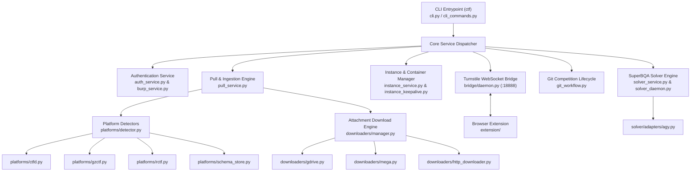

# Deep Dive: `ctf` CLI Toolkit Engine (`ctf_downloader`)

The `ctf` CLI is a modular operations engine implemented in Python under the package name `ctf_downloader` ([`/home/wsl/tools/auto_download_ctf_challenge/`](file:///home/wsl/tools/auto_download_ctf_challenge/)). It automates platform synchronization, file acquisition, dynamic cloud containers, browser-bridged network bypasses, and autonomous solver pools.

---

## 1. System Architecture

---

## 2. Core Subsystems & Mechanisms

### A. Platform Abstraction Layer (`platforms/`)
* **Detection:** [`detector.py`](file:///home/wsl/tools/auto_download_ctf_challenge/ctf_downloader/platforms/detector.py) inspects response headers (`Server`, `Set-Cookie`), HTML DOM markers (e.g. `<meta name="csrf-token">`), and common API routes (`/api/v1/challenges`, `/api/game/challenges`) to detect platform engines automatically.
* **Schema Store:** [`schema_store.py`](file:///home/wsl/tools/auto_download_ctf_challenge/ctf_downloader/platforms/schema_store.py) allows defining JSON schema definitions for custom platforms without modifying code.
* **Supported Platforms:**
  * **CTFd:** Standard REST endpoints, challenge tags, hints, and file downloads.
  * **GZCTF:** Modern ASP.NET Core platform with dynamic container ports and crypto challenges.
  * **rCTF:** Redpwn-style JSON APIs.
  * **MetaCTF / Custom REST:** Adaptable mapping for private event architectures.

---

### B. Multi-Source Attachment Ingestion Pipeline (`downloaders/`)
* **Dispatcher:** [`downloaders/manager.py`](file:///home/wsl/tools/auto_download_ctf_challenge/ctf_downloader/downloaders/manager.py) analyzes attachment URLs and dispatches downloads to dedicated handlers.
* **Handlers:**
  * `gdrive.py`: Handles Google Drive confirmation tokens and quota bypasses.
  * `mega.py`: Uses `megatools` or direct API stream decoders.
  * `http_downloader.py`: Resilient chunked streaming with ETag checking, Last-Modified validation, and strict SHA-256 integrity verification.

---

### C. Cloudflare Turnstile Bypass via Browser Bridge (`bridge/`)
When challenge platforms or download endpoints enforce Cloudflare Turnstile / Managed Challenges:
1. `ctf bridge start` spins up an internal WebSocket daemon on `127.0.0.1:18888`.
2. The companion browser extension ([`extension/`](file:///home/wsl/tools/auto_download_ctf_challenge/extension/)) pairs with the daemon using a generated security token.
3. Network traffic routed with `--bridge` is forwarded through the browser, carrying authenticated cookies (`cf_clearance`, session cookies) directly through Cloudflare's security perimeter.

---

### D. Dynamic Instance Keepalive Daemon (`instance_keepalive.py`)
Dynamic challenges (e.g. on-demand web/pwn containers) have short lifespans (typically 15–30 minutes):
* The keepalive daemon runs in the background, monitoring container time-to-live (TTL).
* Automatically issues renewal requests to the platform API before the container expires, ensuring solver scripts do not fail due to mid-exploitation termination.

---

### E. SuperBQA Parallel Solver Engine (`solver/`)
* **Architecture:** Orchestrates concurrent AI solver workers inside challenge subdirectories.
* **Adapter Architecture:** Decouples solver logic from model APIs:
  * [`adapters/agy.py`](file:///home/wsl/tools/auto_download_ctf_challenge/ctf_downloader/solver/adapters/agy.py): Drives local `agy` instances in non-interactive streaming mode.
  * [`adapters/claude.py`](file:///home/wsl/tools/auto_download_ctf_challenge/ctf_downloader/solver/adapters/claude.py) & [`adapters/codex.py`](file:///home/wsl/tools/auto_download_ctf_challenge/ctf_downloader/solver/adapters/codex.py).
* **Category Prompt Templates:** Injects domain-specific instructions (`prompts/pwn.prompt.txt`, `prompts/crypto.prompt.txt`, etc.).
* **Self-Recovery:** Detects rate limits or model safety blocks and automatically activates context rollback.

---

### F. Git Lifecycle Management (`services/git_workflow.py`)
* `ctf git init -d <DIR> --remote-url <URL>`: Configures a central Git repository for archiving all competitions.
* Automatically checks out an event branch (`ctf/<event_name>`) upon `ctf pull`.
* Automatically commits checkpoints when challenges or solvers update.
* `ctf git finish`: Merges the event branch into `main` (`--no-ff`) and archives the competition state.

---

## 3. Configuration & State Persistence

Global configuration is persisted in [`~/.config/ctf_toolkit/config.json`](file:///home/wsl/.config/ctf_toolkit/config.json):
* **Auth Map:** Caches platform URLs, session cookies, and API tokens.
* **Active Workspaces:** Tracks active event directories on disk.
* **Theme Preferences:** Stores terminal theme settings (`cyberpunk`, `matrix`, `exodia`, `dracula`).
