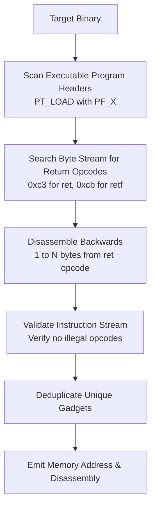

# Deep Dive: `ROPgadget` & Gadget Extraction Engines

`ROPgadget` ([`/home/wsl/.local/bin/ROPgadget`](file:///home/wsl/.local/bin/ROPgadget)) and its companion tool `ropper` are automated gadget extraction engines. They scan compiled binaries to find small instruction sequences suitable for Return-Oriented Programming (ROP).

---

## 1. Fundamentals of Return-Oriented Programming (ROP)

When binary mitigations enforce **NX / DEP** (No-Execute stack/heap), direct shellcode execution is blocked. ROP circumvents NX by chaining existing instruction sequences already present in executable memory segments (`.text` or shared libraries like `libc.so`).

### What is a "Gadget"?
A gadget is a short sequence of assembly instructions—typically 2 to 5 instructions—ending in a return instruction:
* **Standard Return Gadget:** Ends in `ret` (`0xc3` on x86/x64).
* **Jump/Call Gadget (JOP/COP):** Ends in an indirect jump or call (e.g. `jmp rax`, `call rbx`).
* **Syscall Gadget:** Ends in `syscall; ret` (or `int 0x80; ret` on x86).

### Execution Chain:
By placing a sequence of gadget addresses onto the stack, the CPU executes the first gadget, encounters `ret`, pops the next gadget address from the stack into `$rip`, and continues executing the chain:
```text
Stack Layout:
[ Low Address ]
  Address of Gadget 1:  pop rdi; ret   <--- Stack Pointer ($rsp)
  Argument Value:       0x00404020     <--- Popped into $rdi
  Address of Gadget 2:  puts@plt       <--- Called with $rdi as arg 1
[ High Address ]
```

---

## 2. Internal Discovery Algorithm

ROPgadget discovers gadgets through backward instruction disassembly:



1. **Segment Extraction:** Parses the ELF header to locate segments marked executable (`PF_X`).
2. **Byte Stream Scanning:** Searches linear memory for return opcodes (`0xc3` for near `ret`, `0xc2` for `ret imm16`, `0xcb` for far `ret`).
3. **Backward Disassembly (Sliding Window):** Beginning 1 to $N$ bytes (where $N$ is `--depth`, default 10) prior to the `0xc3` byte, the disassembler attempts to parse instructions forward. If the forward decode cleanly terminates at the return instruction without encountering illegal opcodes, the sequence is registered as a valid gadget.
4. **Deduplication:** Normalizes instruction text and eliminates redundant offsets.

---

## 3. High-Value Gadgets in CTF Exploitation

Under the **System V AMD64 ABI** (standard Linux x86_64 calling convention), the first six integer/pointer function arguments are passed in registers:
$$\text{arg1} = \mathbf{rdi}, \quad \text{arg2} = \mathbf{rsi}, \quad \text{arg3} = \mathbf{rdx}, \quad \text{arg4} = \mathbf{rcx}, \quad \text{arg5} = \mathbf{r8}, \quad \text{arg6} = \mathbf{r9}$$

### Essential Gadget Types:
1. **`pop rdi; ret`:**
   * **Use Case:** Passing the first argument to functions (e.g. `puts(target_ptr)` or `system("/bin/sh")`).
2. **`pop rsi; pop r15; ret`:**
   * **Use Case:** Passing the second argument (often found coupled with a dummy register in `__libc_csu_init`).
3. **`ret` (The Stack Align Gadget):**
   * **The `movaps` Alignment Trap:** 64-bit GLIBC functions (like `printf`, `puts`, `system`) utilize SSE SIMD instructions (e.g. `movaps [rsp+...], xmm...`). The x86_64 ABI requires the stack pointer (`$rsp`) to be **16-byte aligned** upon function entry. Chaining an odd number of return addresses causes `$rsp` to end in `0x...8`, crashing the process with `SIGSEGV` inside libc. Inserting a lone `ret` gadget realigns the stack by 8 bytes, fixing the crash.
4. **`leave; ret`:**
   * **Use Case:** Stack pivoting. `leave` is equivalent to:
     ```assembly
     mov rsp, rbp
     pop rbp
     ```
     By controlling `$rbp`, an attacker pivots `$rsp` to an attacker-controlled buffer in the heap or BSS.

---

## 4. Key CLI Flags & Practical Usage

```bash
# Basic gadget search
ROPgadget --binary ./chall

# Filter for specific register operations
ROPgadget --binary ./chall --only "pop|ret"

# Search for gadgets containing specific strings
ROPgadget --binary ./chall --grep "pop rdi"

# Avoid specific bad characters (e.g. null bytes or newlines)
ROPgadget --binary ./chall --badbytes "00|0a|0d"

# Search for writable memory containing string "/bin/sh"
ROPgadget --binary ./libc.so.6 --string "/bin/sh"

# Increase backward disassembly depth
ROPgadget --binary ./chall --depth 15
```
