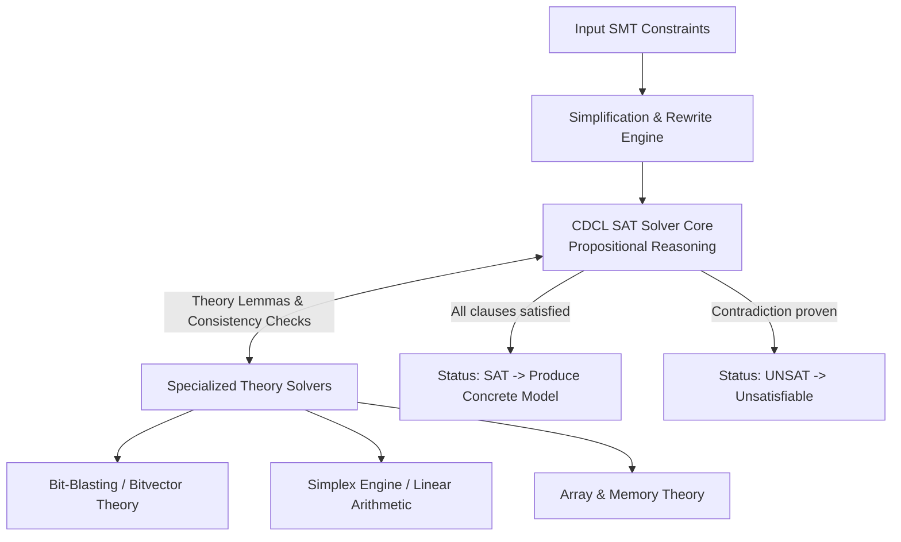

# Deep Dive: Microsoft Z3 SMT Solver

The **Z3 Theorem Prover** ([`/home/wsl/.local/bin/z3`](file:///home/wsl/.local/bin/z3), accessible via Python's `z3-solver` module) is an SMT (Satisfiability Modulo Theories) solver developed by Microsoft Research. In CTF reverse engineering and constraint verification, Z3 translates complex algorithmic and bitwise validation routines into automatically solvable mathematical systems.

---

## 1. What is an SMT Solver?

* **SAT (Boolean Satisfiability):** Determines whether there exists an assignment of `TRUE`/`FALSE` values to Boolean variables that satisfies a given propositional formula.
* **SMT (Satisfiability Modulo Theories):** Extends SAT by supporting richer first-order logic theories, including:
  * **Fixed-size Bitvectors:** Replicates exact CPU register arithmetic (8, 16, 32, 64 bits) with overflow, underflow, and bitwise logic (`XOR`, `AND`, `OR`, shifts).
  * **Linear & Non-linear Arithmetic:** Equations over integers ($\mathbb{Z}$) and real numbers ($\mathbb{R}$).
  * **Arrays & Uninterpreted Functions:** Models computer memory layouts and lookup tables.

---

## 2. Internal Solver Architecture: The $\text{DPLL}(T)$ Framework

Z3 implements the **$\text{DPLL}(T)$** architecture:



1. **Conflict-Driven Clause Learning (CDCL):** The propositional core makes trial assignments, deduces implications, and learns new conflict clauses when encountering dead ends.
2. **Theory Solvers ($T$):** When the SAT core assigns values to theory predicates (e.g. $a + b > 5$), specialized solvers verify whether those assignments are mathematically consistent.
3. **Bit-Blasting:** For bitvector constraints, Z3 converts fixed-width arithmetic operations into direct Boolean circuits (AND/OR/XOR gates), delegating high-speed solving to the underlying SAT engine.

---

## 3. Why `BitVec` is Essential for Reversing

A common mistake is using `z3.Int('x')` to model C variables. In C, standard integer types wrap around upon overflow:
$$\text{uint8\_t: } 250 + 10 = 4 \quad (\text{mod } 256)$$
* `z3.Int` models unbounded mathematical integers: $250 + 10 = 260$.
* `z3.BitVec('x', 8)` models a precise 8-bit register where $250 + 10 = 4$, faithfully replicating CPU architecture behavior.

---

## 4. Practical Python Workflow & Solver Patterns

### Example: Automated Keygen Reversing
Given a decompiled C loop that validates an input flag:
```c
// Decompiled check loop
for (int i = 0; i < 4; i++) {
    if (((flag[i] ^ 0x5a) + 0x14) != target[i]) return 0;
}
```

### Corresponding Z3 Solver Script:
```python
from z3 import *

# 1. Initialize solver instance
s = Solver()

# 2. Define symbolic bitvector variables
flag_len = 4
flag = [BitVec(f"flag_{i}", 8) for i in range(flag_len)]

# 3. Constrain characters to printable ASCII
for b in flag:
    s.add(b >= 0x20, b <= 0x7e)

# 4. Add decompiled algebraic constraints
targets = [0x78, 0x82, 0x6e, 0x91]
for i in range(flag_len):
    s.add(((flag[i] ^ 0x5a) + 0x14) == targets[i])

# 5. Check satisfiability and extract concrete model
if s.check() == sat:
    model = s.model()
    solution = bytes([model[b].as_long() for b in flag])
    print(f"[+] Recovered Solution: {solution.decode()}")
else:
    print("[-] Constraints are UNSAT (no solution exists)")
```

---

## 5. Advanced Solver Patterns

### A. Logical vs. Arithmetic Right Shift
* `flag >> 2` in Z3 performs an **arithmetic shift** (sign-extended, preserving the MSB).
* `LShR(flag, 2)` performs a **logical right shift** (zero-filled), matching `unsigned int` in C.

### B. Finding Multiple / All Valid Solutions
To verify whether a solution is unique:
```python
while s.check() == sat:
    m = s.model()
    # Print current solution...
    # Block current solution to force solver to find another
    block = Or([var != m[var] for var in flag])
    s.add(block)
```
